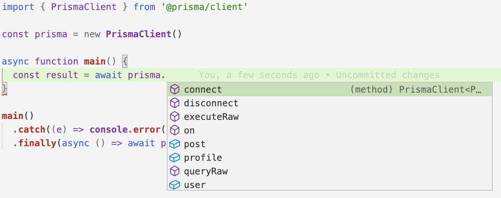

# 2. Prisma Client kennenlernen

## Ziel

Ziel dieser Lektion ist es, sich mit der [Prisma Client API](https://www.prisma.io/docs/reference/api-reference/prisma-client-reference) vertraut zu machen und einige der verfügbaren Datenbankabfragen auszuprobieren, die du damit senden kannst. Du lernst CRUD-Abfragen, Relationsabfragen wie Nested Writes, Filterung und Paginierung kennen. Nebenbei wirst du eine weitere Migration durchführen, um ein zweites Modell mit einer Relation zum zuvor erstellen `User` -Modell einzuführen.

## Setup

Du kannst in demselben `prisma-workshop` -Projekt weiterarbeiten, das du schon in Lektion 1 eingerichtet hast. Die Datei  `script.ts` enthält eine `main` -Funktion, die bei jeder Ausführung des Skripts ausgeführt wird. 

## Tipps

- ***Tippe selbst*, kein Copy/Paste**
    
    Um zu lernen und wirklich zu verstehen, was du für jede Aufgabe tust, achte darauf, die Lösung **nicht zu kopieren und einzufügen**, sondern die Lösung selbst abzutippen (auch wenn du diese nachschlagen musst). 
    
- **Autovervollständigung**
    
    Prisma Client bietet eine Reihe von Abfragen, die du über die dazugehörige API an deine Datenbank senden kannst. Du kannst dich in der [Dokumentation](https://www.prisma.io/docs/reference/tools-and-interfaces/prisma-client) über diese Abfragen informieren oder die API direkt im Editor mithilfe der *Autovervollständigung* erkunden.
    
    Um die Autovervollständigung aufzurufen, öffne `src/index.ts` und gib *innerhalb* der `main` -Funktion folgendes ein (du kannst den Kommentar `// ... your Prisma Client queries will go here` löschen, der sich derzeit dort befindet):
    
    ```tsx
    import { PrismaClient } from '@prisma/client'
    
    const prisma = new PrismaClient()
    
    async function main() {
      const result = await **prisma.** // Autovervollständigung wird angezeigt, wenn du das eintippst
    }
    
    main()
      .catch((e) => console.error(e))
      .finally(async () => await prisma.disconnect())
    ```
    
    - Erweitere für ein Screenshot der Autovervollständigung
        
        
        
    
    Sobald du die Zeile `const result = await prisma.`  ****in deinem Editor eingegeben hast, wird ein kleines Popup-Fenster angezeigt, in dem du die Optionen für das Zusammenstellen einer Abfrage auswählen kannst (z.B. die Auswahl eines *model,* das du abfragen möchtest, oder die Verwendung einer anderen Top-Level-Funktion wie  `queryRaw` oder `connect`). Autovervollständigung ist für die *gesamte* Abfrage verfügbar, einschließlich aller Argumente, die du dafür eventuell angeben möchstest!
    
- **Prisma Studio**
    
    Prisma Studio ist eine GUI für deine Datenbank, mit der du dir Daten anzeigen und bearbeiten kannst. Mit dem folgenden Befehl kannst du Prisma Studio starten:
    
    ```tsx
    npx prisma studio
    ```
    

## Aufgaben

Am Ende jeder Aufgabe kannst du das Skript mit dem folgenden Befehl ausführen:

```bash
npm run dev
```

### Aufgabe 1: Schreibe eine Abfrage, um *alle* `User` -Einträge zurückzugeben

Um sich ein wenig aufzuwärmen, schreibe eine Abfrage, die *alle* `User` -Einträge aus der Datenbank zurückgibt. Gebe das Ergebnis mit `console.log` auf der Konsole aus.

- Lösung
    
    ```tsx
    import { PrismaClient } from '@prisma/client'
    
    const prisma = new PrismaClient()
    
    async function main() {
      const result = await prisma.user.findMany()
    	****console.log(result)
    }
    
    main()
      .catch((e) => console.error(e))
      .finally(async () => await prisma.$disconnect())
    ```
    

### Aufgabe **2: Schreibe eine Abfrage, um einen neuen** `User` **-Eintrag zu erstellen**

In dieser Aufgabe wirst du einen weiteren `User` -Eintrag erstellen. Gib in deiner Prisma Client-Abfrage nur einen Wert für `email` , aber *nicht* für `name` an:

- `email`: `"alice@prisma.io"`

Schaffst du es, eine Abfrage zu finden, mit der du das tun kannst? 

- Lösung
    
    ```tsx
    import { PrismaClient } from '@prisma/client'
    
    const prisma = new PrismaClient()
    
    async function main() {
      const result = await prisma.user.create({
        data: {
          email: "alice@prisma.io"
        }
      })
    	console.log(result)
    }
    
    main()
      .catch((e) => console.error(e))
      .finally(async () => await prisma.$disconnect())
    ```
    

### Aufgabe 3: Schreibe eine Abfrage zum Aktualisieren eines vorhandenen `User`-Eintrags

In dieser Aufgabe aktualisiert du den soeben erstellten `User` -Eintrag und fügst einen Wert für seinen `name` -Feld hinzu:

- `name`: `"Alice"`

Wie kannst du einen bestehenden Datenbankeintrag mit Prisma Client aktualisieren?

- Lösung
    
    ```tsx
    import { PrismaClient } from '@prisma/client'
    
    const prisma = new PrismaClient()
    
    async function main() {
      const result = await prisma.user.update({
        where: {
          email: "alice@prisma.io"
        },
        data: {
          name: "Alice"
        }
      })
    	console.log(result)
    }
    
    main()
      .catch((e) => console.error(e))
      .finally(async () => await prisma.$disconnect())
    ```
    

### Aufgabe 4: Hinzufügen einer `Post`-Tabelle zu deiner Datenbank

Um weitere interessante Prisma Client-Abfragen zu erkunden, erweitern wir dein Prisma-Schema um eine weiteres Modell und konfigurieren so eine [*Relation*](https://www.prisma.io/docs/concepts/components/prisma-schema/relations) zwischen dem bestehenden und dem neuen Modell.

Das neue `Post` -Modell soll wie folgst aussehen:

- `id`: ein automatisch inkrementierender Integer zur eindeutigen Identifizierung jedes Beitrags in der Datenbank
- `title`: der Titel eines Beitrags; dieses Feld sollte in der Datenbank *required* sein
- `content`: der Inhalt/Text des Beitrags; dieses Feld sollte in der Datenbank *optional* sein
- `published`: gibt an, ob ein Beitrag veröffentlicht wird oder nicht; dieses Feld sollte in der Datenbank *required* sein; standardmäßig sollte jeder Beitrag, der erstellt wird, *nicht* veröffentlicht werden
- `author` und `authorId`: konfiguriert eine *Relation*  von einem Beitrag zu einem Benutzer, der als Autor des Beitrags gelten soll; die Relation sollte *optional* sein, sodass ein Beitrag nicht unbedingt einen Autor in der Datenbank benötigt; beachte, dass *alle* Relationen bidirektional sind, d.h. du musst die zweite Seite der Relation auch im bereits vorhandenen `User` -Modell hinzufügen
- Lösung
    
    ```graphql
    model User {
      id    Int     @id @default(autoincrement())
      name  String?
      email String  @unique
      posts Post[]
    }
    
    model Post {
      id        Int     @id @default(autoincrement())
      title     String
      content   String?
      published Boolean @default(false)
      author    User?   @relation(fields: [authorId], references: [id])
      authorId  Int?
    }
    ```
    

Sobald du das Prisma-Schema angepasst hast und deine beiden Modelle vorhanden sind, führe eine Migration durch, um die Änderungen auf deine Datenbank anzuwenden:

```graphql
npx prisma migrate dev --name add-post
```

### Aufgabe **5: Schreibe ein Abfrage, um einen neuen `Post` -Eintrag zu erstellen**

In dieser Aufgabe wirst du einen neuen `Post`-Eintrag mit dem Titel `"Hello World"` erstellen. 

- Lösung
    
    ```tsx
    import { PrismaClient } from '@prisma/client'
    
    const prisma = new PrismaClient()
    
    async function main() {
      const result = await prisma.post.create({
        data: {
          title: "Hello World"
        }
      })
    	console.log(result)
    }
    
    main()
      .catch((e) => console.error(e))
      .finally(async () => await prisma.$disconnect())
    ```
    

### Aufgabe 6: Schreibe eine Abfrage, um `User` - und `Post` -Einträge zu verbinden

Du hast nun mehrere `User`-Einträge und genau einen `Post`-Eintrag in der Datenbank, diese kannst du über die Fremdschlüssel-Spalte `authorId` verbinden. 

Wenn du Prisma Client verwendet, musst du den Fremdschlüssel nicht manuell festlegen, sondern kannst Relationen mithilfe der typ-sicheren API von Prisma Client konfigurieren. Findest du heraus, wie du den  `Post` -Eintrag **aktualisieren** kannst und ihn über das  `email`-Feld mit einem vorhandenen `User` -Eintrag **verbinden** kannst?

Verwende die Autovervollständigung des Editors, um dich über die Abfrage zu informieren, oder lies die [Dokumentation](https://www.prisma.io/docs/concepts/components/prisma-client/relation-queries#connect-an-existing-record).

- Lösung
    
    ```tsx
    import { PrismaClient } from "@prisma/client";
    
    const prisma = new PrismaClient();
    
    async function main() {
      const result = await prisma.post.update({
        where: { id: 1 },
        data: {
          author: {
            connect: { email: "alice@prisma.io" },
          },
        },
      });
      console.log(result);
    }
    
    main()
      .catch((e) => console.error(e))
      .finally(async () => await prisma.$disconnect());
    ```
    

### Aufgabe 7: Schreibe eine Abfrage, um einen einzelnen `User`-Eintrag anhand einen eindeutigen Werts abzurufen

In Aufgabe 1 hast du gelernt, wie man eine Liste von Datensätzen aus der Datenbank abruft. In dieser Aufgabe musst du einen einzelnen `User`-Eintrag mit deiner Prisma Client-Abfrage nach einem *eindeutigen* Wert abrufen.

- Lösung
    
    ```tsx
    import { PrismaClient } from "@prisma/client";
    
    const prisma = new PrismaClient();
    
    async function main() {
      const result = await prisma.user.findUnique({
        where: { email: "alice@prisma.io" }
      })
      console.log(result)
    }
    
    main()
      .catch((e) => console.error(e))
      .finally(async () => await prisma.$disconnect());
    ```
    
    Beachte, dass du jedes *eindeutige* Feld eines Prisma-Models verwenden kannst, um einen Datensatz über das Argument  `where` zu identifizieren, so dass du in diesem Fall einen `User` -Eintrag auch über seine `id` identifizieren kannst.
    

### Aufgabe 8: Schreibe eine Abfrage, die nur eine Teilmenge von Feldern auswählt

Für diese Aufgabe kannst du die gleiche  `findMany` -Abfrage für User wiederverwenden, du du auch in Aufgabe 1 verwendet hast. Diesmal ist dein Ziel jedoch, nur eine Teilmenge der Felder des  `User` -Modells auszuwählen, und zwar solle alle zurückgegebenen Objekte nur die `id` und den  `name` , *nicht* aber das  `email` -Feld enthalten. 

- Lösung
    
    ```tsx
    import { PrismaClient } from "@prisma/client";
    
    const prisma = new PrismaClient();
    
    async function main() {
      const result = await prisma.user.findMany({
        select: {
          id: true,
          name: true
        }
      })
    	console.log(result)
    }
    main()
      .catch((e) => console.error(e))
      .finally(async () => await prisma.$disconnect());
    ```
    

### Aufgabe 9: Schreibe eine Nested Write Abfrage, um eine Relation in das Ergebnis *aufzunehmen*

Du wirst nun beginnen, weitere [Relationsabfragen](https://www.prisma.io/docs/reference/tools-and-interfaces/prisma-client/relation-queries) von Prisma Client zu erkunden! Beginnen wir mit einer Nested Read Abfrage, bei der du eine Relation *einschließt*, konkret: Nimm deine Abfrage aus Aufgabe 7 und schließe die Relation zur Tabelle  `Post` in das Ergebnis ein.

- Lösung
    
    ```tsx
    import { PrismaClient } from "@prisma/client";
    
    const prisma = new PrismaClient();
    
    async function main() {
      const result = await prisma.user.findUnique({
        where: { email: "alice@prisma.io" },
        include: { posts: true },
      });
      console.log(result);
    }
    
    main()
      .catch((e) => console.error(e))
      .finally(async () => await prisma.$disconnect());
    ```
    
    Beachte, dass das `result` deiner Abfrage vollständig typisiert ist! Der Typ wird on the fly von Prisma Client generiert, so sieht er aus: 
    
    ```tsx
    const result: (User & { posts: Post[]; }) | null
    
    // ... where the `Post` and `User` types look as follows:
    
    type Post = {
      id: number
      title: string
      content: string | null
      published: boolean
      authorId: number | null
    }
    
    type User = {
      id: number
      name: string | null
      email: string
    }
    ```
    

### Aufgabe 10: Schreibe eine Nested Write Abfrage, um einen neuen `User`-Eintrag mit einem neuen `Post` -Eintrag zu erstellen

In dieser Aufgabe wirst du einen neuen `User`-Eintrag zusammen mit einem neuen `Post` -Eintrag in einer *einzigen* Prisma Client-Abfrage (nested write) erstellen. Du kannst wieder die Autovervollständigung verwenden, um die richtige Abfrage herauszufinden, oder die Dokumentation [hier](https://www.prisma.io/docs/reference/tools-and-interfaces/prisma-client/relation-queries#nested-writes) lesen.  

- Lösung
    
    ```tsx
    import { PrismaClient } from "@prisma/client";
    
    const prisma = new PrismaClient();
    
    async function main() {
      const result = await prisma.user.create({
        data: {
          name: "Nikolas",
          email: "burk@prisma.io",
          posts: {
            create: { title: "A practical introduction to Prisma" },
          },
        },
      });
      console.log(result);
    }
    
    main()
      .catch((e) => console.error(e))
      .finally(async () => await prisma.$disconnect());
    ```
    

### Aufgabe 11: Schreibe eine Abfrage, die nach Benutzern filtert, deren Namen mit "A" beginnen

Für diese Aufgabe kannst du dieselbe `findMany` Abfrage für Benutzer wiederverwenden, die du in Aufgabe 1 verwendet hast.  Diesmal willst du aber nicht *alle* `User`  -Einträge zurückgeben, sondern nur diejenigen, die einen `name`  haben, der mit dem Buchstaben `"A"` beginnt. Kannst du den richtigen [Operator](https://www.prisma.io/docs/reference/api-reference/prisma-client-reference/#filter-conditions-and-operators) finden, mit dem du dieses Bedingung ausdrücken kannst?

- Lösung
    
    ```tsx
    import { PrismaClient } from "@prisma/client";
    
    const prisma = new PrismaClient();
    
    async function main() {
      const result = await prisma.user.findMany({
        where: {
          name: {
            startsWith: "A",
          },
        },
      });
      console.log(result);
    }
    
    main()
      .catch((e) => console.error(e))
      .finally(async () => await prisma.$disconnect());
    ```
    

### Aufgabe 12: Schreibe eine Paginierungs-Abfrage

Prisma Client bietet mehrere Möglichkeiten, über eine Liste von Objekten zu paginieren. Verwende die `findMany` -Abfrage von vorhin, um nur den *dritten* und *vierten* `User` -Eintrag zurückzugeben.

- Lösung
    
    ```tsx
    import { PrismaClient } from "@prisma/client";
    
    const prisma = new PrismaClient();
    
    async function main() {
      const result = await prisma.user.findMany({
        skip: 2,
        take: 2,
      });
      console.log(result);
    }
    
    main()
      .catch((e) => console.error(e))
      .finally(async () => await prisma.$disconnect());
    ```
    

### Nächste Schritte

Mit diesen Aufgaben hast du nur an der Oberfläche dessen gekratzt, was mit der Prisma CLient API möglich ist. Du kannst gerne weitere Abfragen erkunden und einige der Odering-, Upsert-, Plain-SQL- oder andere Funktionen ausprobieren.